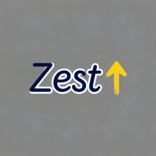

# Zest SSG

<p align="center">
  
</p>

<h1 align="center">Zest SSG</h1>
<p align="center"><em>Zest: Easy Static-site Toolkit</em></p>
<p align="center">
  <a href="LICENSE">License</a> · <a href="#quick-start">Quick Start</a> · <a href="#documentation">Docs</a>
</p>

---

**Zest** is a hybrid F# + C# static site generator in which templates are real code, not strings. It is built on a single premise: your templating language and your host language should be one and the same.

---

## Table of Contents

- [Why Zest?](#why-zest)
- [Features](#features)
- [Quick Start](#quick-start)
- [Writing Content](#writing-content)
- [Templates](#templates)
- [Project Layout](#project-layout)
- [Commands](#commands)
- [Architecture](#architecture)
- [Documentation](#documentation)
- [Building from Source](#building-from-source)
- [Design Philosophy](#design-philosophy)
- [License](#license)

---

## Why Zest?

- **Fast.** Pages are compiled in parallel, cached aggressively, and served by a dev server with live reload. Large sites stay responsive because the build pipeline is embarrassingly parallel by design.

- **F# everywhere.** Pages can be written as ordinary F# programs using a type-safe HTML DSL — loops, conditionals, functions, and data, with no template-language workarounds. Markdown remains available whenever prose is preferable to code.

- **No lock-in.** The engine is template-engine agnostic. Nunjucks is the default, with a compatibility layer for 11ty-style languages (Liquid, HAML, Pug) and a standalone engine for native Handlebars/Mustache (`.hbs`, `.mustache`). Output is plain, static HTML that can be hosted anywhere.

- **Quiet by default.** The bundled starter theme ships with no animation, no shadows, and no hover theatrics — typography and whitespace carry the page.

- **A single binary.** One `dotnet` CLI tool handles `init`, `build`, `serve`, `clean`, and `preview`.

---

## Features

- **Template as Code** — `.zest.fsx` files are real F# scripts executed at build time via `dotnet fsi`. Full F# is available: list comprehensions, pattern matching, string interpolation, and arbitrary computation.

- **HTML DSL** — Compose HTML declaratively, e.g. `render [ h1 []; p [] ]`.

- **Inline Markdown** — Write Markdown directly inside a `.zest.fsx` page using the `md` helper, and mix it with the HTML DSL: `md """# Title\n**bold**"""`.

- **Markdown posts** — Standard `.md` files with frontmatter support.

- **ZCSS** — A CSS superset with nesting, F#-style `let` bindings, math expressions, color functions, and mixins — compiled to standard CSS.

- **11ty-compatible templates** — Full support for Nunjucks (`.njk`), Liquid (`.liquid`), Handlebars (`.hbs`), Mustache (`.mustache`), HAML (`.haml`), and Pug (`.pug`). Nunjucks, Liquid, HAML, and Pug are auto-converted to the Nunjucks engine for filters, macros, template inheritance, and Zest API integration. `.hbs` and `.mustache` run on a dedicated Mustache/Handlebars engine that preserves their native syntax.

- **`_init.zest.fsx`** — An optional initialization script (run before each build) for injecting dynamic data, loading JSON/TOML, and reading environment variables.

- **TOML configuration** — Zero-config defaults; customize via `_config.toml` and `_data/*.toml`. No YAML.

- **Live reload** — `zest serve` watches for changes and rebuilds automatically.

- **Batch evaluation** — Multiple F# page scripts are evaluated in a single FSI process for fast builds.

- **Incremental builds** — File-change detection skips unchanged pages and assets.

- **Cross-platform** — Builds for Windows x64, Linux x64/ARM64, and macOS ARM64.

---

## Quick Start

```bash
# Scaffold a new project
zest init my-site

# Develop with live reload
cd my-site && zest serve --port 8080

# Build for production
zest build

# Preview the built site
zest preview
```

---

## Writing Content

### Markdown posts

```markdown
+++
title = "Hello, world"
date = 2026-01-15
tags = ["zest", "fsharp"]
layout = "post"
+++
This is a blog post.
```

### Pages as F# (`.zest.fsx`)

```fsharp
// @title About
// @layout default
render [
  h1 [ text "About this site" ]
  p  [ text "Written in F#, rendered as HTML." ]
]
```

### Example: a `.zest.fsx` page

```fsharp
// @title Hello World
// @layout default
// @description My first Zest page
let pageTitle = "Hello from F#"
let items = ["F#"; "Zest"; "SSG"]

render [
    h1 [ text pageTitle ]
    p  [ text "This page is generated by real F# code at build time." ]
    ul [ for i in items -> li [ text i ] ]
]
```

### Example: inline Markdown inside a `.zest.fsx` page

The `md` helper renders a Markdown string to an HTML string, so prose and the F# HTML DSL can be blended within a single page. Like every other DSL builder, `md` returns a plain `string`.

```fsharp
// @title About
// @layout default
open Zest.Dsl

render [
    divC "about" [
        md """
# About
This page is a **native template** written in `.zest.fsx` (real F#), where
Markdown and the HTML DSL live side by side.
Learn more at the [Zest repository](https://github.com/zest-ssg/zest).
"""
    ]
]
```

### Styles as ZCSS (`.zcss`)

```zcss
// F#-style let bindings with math expressions
let primary       = #3b82f6
let space1        = 0.25r
let space4        = space1 * 4          // 1rem
let primary-light = primary |> lighten(45%)

.tag [
  color: $primary
  background-color: $primary-light
  padding-block: $space4
  border-radius: 9999px
]
```

Compiles to:

```css
.tag {
  color: #3b82f6;
  background-color: #adf4ff;
  padding-block: 1rem;
  border-radius: 9999px;
}
```

### Data

`_init.zest.fsx` runs before every build and can inject global data:

```fsharp
addGlobal "socials" [
  {| label = "GitHub"; url = "https://github.com/zest"; icon = "github" |}
]
```

Templates read it as `{{ site.socials }}`.

---

## Templates

Layouts and partials are plain HTML processed by a template engine. Nunjucks is the default. Other 11ty-compatible languages are auto-converted to Nunjucks internally — except `.hbs` and `.mustache`, which run on a standalone Mustache/Handlebars engine, since the Nunjucks converter cannot fully express their syntax.

```html
<!DOCTYPE html>
<html lang="{{ site.language }}">
<head>
  <meta charset="utf-8">
  <title>{{ site.title }}</title>
  <link rel="stylesheet" href="/assets/css/main.css">
</head>
<body>
  {{ include header.html }}
  <main>
    {{ content | safe }}
  </main>
  {{ include footer.html }}
</body>
</html>
```

Supported Nunjucks constructs include `{{ include }}`, `{{ content }}`, `` / ``, ``, filters (`| t`, `| date`, `| readingTime`), and i18n strings from `_locales/*.toml`.

> **Note:** The `template_engine` field in `_config.toml` is declarative only — it documents which engine the templates were written for. Layout routing is decided by file extension, so a project may freely mix Nunjucks, Handlebars, Liquid, and other templates.

---

## Project Layout

```
.
├── zest.toml              # CLI configuration
├── _config.toml           # site metadata and build options
├── _init.zest.fsx         # pre-build script (global data, hooks)
├── _data/                 # global data (nav.toml, …)
├── _themes/<name>/        # self-contained themes
│   ├── _theme.toml        # theme manifest
│   ├── _layouts/          # template layouts (.njk / .liquid / .hbs / …)
│   ├── _includes/         # partials
│   ├── _locales/          # i18n string tables
│   └── assets/            # styles (ZCSS), images, fonts
├── content/               # pages (.zest.fsx) and posts (.md)
└── _site/                 # build output
```

---

## Commands

| Command             | Description                                       |
|---------------------|---------------------------------------------------|
| `zest init <name>`  | Scaffold a new site from a starter.               |
| `zest build`        | Build the site into `_site/`.                     |
| `zest serve`        | Start a dev server with live reload.              |
| `zest preview`      | Preview the built site.                           |
| `zest clean`        | Remove build output.                              |

---

## Architecture

| Project        | Language | Responsibility                                                                |
|----------------|----------|-------------------------------------------------------------------------------|
| **Zest.App**   | C#       | CLI entry point, command routing, scaffolding, dev server, embedded starters. |
| **Zest.Engine**| F#       | Build pipeline: content, layouts, ZCSS, data, feeds.                          |
| **Zest.Dsl**   | F#       | Type-safe HTML DSL for `.zest.fsx` pages.                                     |
| **Zest.Infra** | C#       | Configuration loading, file watching, logging, hashing, shared infrastructure.|

---

## Documentation

### File Types

| Extension   | Purpose                                                      | Processing                                          |
|-------------|--------------------------------------------------------------|-----------------------------------------------------|
| `.zest.fsx` | F# script templates (F# + Markdown + HTML DSL)               | Compiled via `dotnet fsi`                           |
| `.njk`      | Nunjucks templates (filters, macros, inheritance, Zest API)  | Rendered via NunjucksEngine                         |
| `.liquid`   | Liquid templates (Jinja2 family, auto-converted)             | Converted → NunjucksEngine                          |
| `.hbs`      | Handlebars templates (native Mustache/Handlebars)            | HbsEngine — standalone, no conversion               |
| `.mustache` | Mustache templates (native Mustache/Handlebars)              | HbsEngine — standalone, no conversion               |
| `.haml`     | HAML templates (auto-converted to HTML → Nunjucks)           | HamlConverter → NunjucksEngine                      |
| `.pug`      | Pug templates (auto-converted to HTML → Nunjucks)            | PugConverter → NunjucksEngine                       |
| `.zcss`     | ZCSS stylesheets (CSS superset)                              | Compiled to `.css`                                  |
| `.md`       | Standard Markdown                                            | Rendered to HTML                                    |
| `.toml`     | Configuration and data (no YAML)                             | Parsed at build time                                |

### ZCSS Reference

| Feature              | Syntax / Example                                                          |
|----------------------|---------------------------------------------------------------------------|
| Variables (SCSS)     | `$name: value;`                                                           |
| Variables (F#)       | `let name = value`                                                        |
| Math                 | `let x = 0.25r * 4`                                                       |
| Color functions      | `lighten(#hex, %)`, `darken(#hex, %)`, `mix(a, b, %)`                     |
| Pipe operator        | `value \|> fn(args)` → `fn(value, args)`                                  |
| Unit shorthands      | `r` → `rem`, `p` → `%`                                                    |
| Property shorthands  | `py` → `padding-block`, `mx` → `margin-inline`, `bgc` → `background-color`|
| Nesting              | Indent or brace mode                                                      |
| Mixins               | `@mixin`, `@include`                                                      |
| Loops                | `@each`, `@for`                                                           |
| Conditionals         | `@if`, `@else`                                                            |
| Built-in modules     | `@use "zest:utilities"`, `@use "zest:palette"`, etc.                      |

### Template Language Annotation

The `template_engine` (top-level) or `[template] engine` field in `_config.toml` is a **pure annotation** describing the site's primary template language. It does not affect the build; layout routing is decided by file extension only.

| Config value | Labels (primary template language)          |
|--------------|---------------------------------------------|
| `native`     | `.zest.fsx` — F# script templates           |
| `nunjucks`   | Nunjucks — `.njk` / `.html` layouts         |
| `liquid`     | Liquid — `.liquid` layouts                  |
| *(any value)*| Pure label; no effect on the build          |

Layouts are routed by file extension: `.hbs` and `.mustache` are rendered by the standalone HbsEngine; all other non-`.zest.fsx` extensions (`.html`, `.njk`, `.liquid`, `.haml`, `.pug`) go through the Nunjucks compatibility layer; and `.zest.fsx` layouts are always evaluated as F# scripts.

### HTML DSL Reference

```fsharp
// Elements
h1 [ text "Title" ]
p  [ text "Paragraph" ]
a  [ href "https://example.com"; text "Link" ]

// Attributes
div [ class' "container"; id "main" ] [ ... ]

// CSS class shortcuts
divC "card"  [ p [ text "Content" ] ]   // <div class="card">
spanC "badge" [ text "New" ]            // <span class="badge">

// List comprehensions
ul [ for item in items -> li [ text item ] ]

// Conditionals
if condition then
    p [ text "Yes" ]
else
    p [ text "No" ]
```

### `_init.zest.fsx` API

| Function              | Purpose                                          |
|-----------------------|--------------------------------------------------|
| `addGlobal key value` | Inject a key-value pair into global data.        |
| `loadJson path`       | Parse a JSON file.                               |
| `loadToml path`       | Parse a TOML file.                               |
| `loadEnv key`         | Read an environment variable.                    |
| `console_log msg`     | Emit debug output to stderr.                     |
| `exec cmd args`       | Run a shell command.                             |

---

## Building from Source

```bash
git clone https://github.com/zest-ssg/zest
cd zest
dotnet build Zest.sln

# Publish for your platform
dotnet publish src/Zest.App/Zest.App.csproj -c Release -r win-x64 --self-contained false
# Linux:  -r linux-x64
# macOS:  -r osx-arm64
```

---

## Design Philosophy

1. **Content is code, code is content.** The F# DSL and the template engine share a single data model, so nothing is lost at the boundary.
2. **No magic.** Every transformation is a plain pipeline stage readable in the source. No hidden runtime and no implied dependencies.
3. **Speed is a feature.** Parallel compilation, minimal allocations, and caching are part of the core design, not an afterthought.
4. **The output is the deliverable.** Static HTML, no JavaScript required, host it anywhere.

Zest is not a general-purpose static site generator. It is a specific answer to specific constraints: F# as the template, TOML as the contract, no Node.js, and no YAML.

---

## License

Apache License 2.0. See [LICENSE](LICENSE).